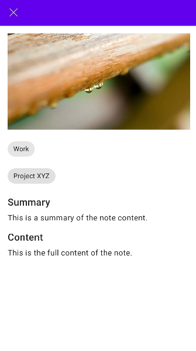

# Smart-Notes-Android-Application
Developed a Kotlin-based Android app using Gemini API and Firebase that generates structured notes from images. It analyzes and categorizes content to auto-create editable, organized notes, enhancing productivity by converting visual input into digital text efficiently.
<p align="center">
  
  
  
</p>

<p align="center">
  <em>Capture. Convert. Create.</em><br>
  <strong>AI-powered Android app to transform images into editable digital notes.</strong>
</p>

---

## 🚀 About the Project

Smart Notes is a productivity-focused Android application that uses AI to generate organized and editable notes from images. With **Gemini API** for image analysis and **Firebase** for real-time data handling, it’s your intelligent assistant for note-taking.

---

## ✨ Key Features

- 📷 **Image-to-Note Conversion** – Extracts text and context from images using Gemini API.
- 🧠 **Smart Categorization** – Automatically classifies and tags notes based on content.
- 📝 **Editable Interface** – Edit, update, and manage notes in real-time.
- ☁️ **Cloud Sync** – Stores data securely using Firebase.
- 🎨 **Clean UI/UX** – User-friendly interface for a seamless experience.

---

## 📱 Screenshots

<p align="center">
  
  
</p>

---

## ⚙️ Tech Stack

| Category        | Tools & Tech                         |
|----------------|--------------------------------------|
| Language        | Kotlin                               |
| AI Integration  | Gemini API                           |
| Cloud Backend   | Firebase (Realtime DB & Auth)        |
| IDE             | Android Studio                       |
| Others          | Postman, XML, Git                    |

---

## 🛠️ Setup Instructions

```bash
# Clone the repository
git clone https://github.com/PremSaiBollamoni/SmartNotesApp.git

# Open in Android Studio

# Add your Gemini API Key and Firebase config in `local.properties` or `google-services.json`

# Build and run the app
